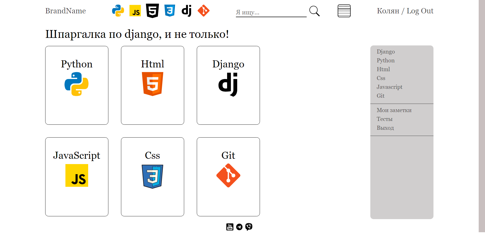
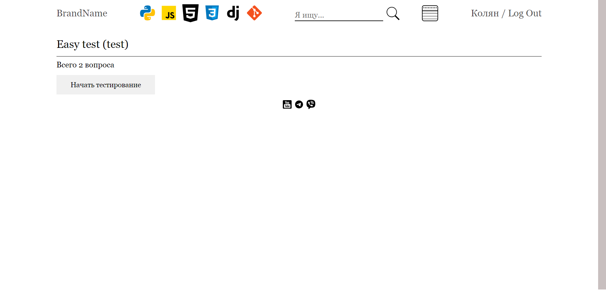

# Quick Tutor

### Описание

На сайте есть 6 добавленых технологий (Python, Django, html, css, git, JavaScript).

На каждую из технологий можно добавлять свои темы и категории.

Каждую тему можно добавлять в заметки, и/или проходить по ней тесты.

### Чему я научился, пока писал этот проект?

Я познакомился или углубился в такие технологии как:

- Django
- Redis
- PostgreSql
- плагин ckeditor
- Django Signals
- Docker
